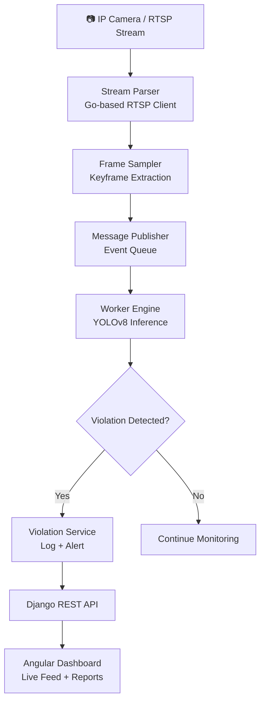

<div align="center">

# 🚦 SentinelAI

**AI-Powered Traffic Surveillance & Violation Detection System**

SentinelAI is a real-time, end-to-end intelligent traffic monitoring platform that ingests live RTSP camera streams, runs computer vision inference using YOLOv8, and automatically detects traffic violations including **overspeeding**, **no helmet**, and **signal jumping**.

[
[
[
[
[
[

</div>

***

## 🧠 System Architecture



***

## ⚙️ Tech Stack

| Layer | Technology | Purpose |
|-------|-----------|---------|
| **Frontend** | Angular v18, PrimeNG | Live dashboard, violation reports |
| **API Backend** | Django REST Framework | REST APIs, data management |
| **Stream Parser** | Go (Golang) | RTSP ingestion, frame sampling |
| **AI Workers** | Python, YOLOv8n | Object detection & violation inference |
| **ML Model** | `yolov8n.pt` (Ultralytics) | Real-time vehicle/person detection |
| **Database** | SQLite (default) | Violation logs, user & camera data |
| **Infrastructure** | Docker, Nginx | Containerized deployment, reverse proxy |

***

## 🚨 Violation Detection Capabilities

| Violation Type | Detection Method | Key Signals |
|---------------|-----------------|-------------|
| 🏎️ **Overspeeding** | Frame-to-frame vehicle tracking | Distance-over-time analysis across frames |
| 🪖 **No Helmet** | YOLOv8 object detection | Rider detected without helmet class |
| 🚦 **Signal Jumping** | Signal state + vehicle position logic | Vehicle crossing stop line on red |

***

## 📁 Project Structure

```bash
SentinelAI/
├── Backend/
│   ├── core/                          # Django application
│   │   ├── camera/                    # Camera registration & management
│   │   ├── mlmodel/                   # ML model configuration
│   │   ├── pipeline/                  # Inference pipeline controllers
│   │   ├── violation/                 # Violation logging & retrieval
│   │   ├── user/                      # Authentication & user management
│   │   ├── media/                     # Uploaded/captured media
│   │   ├── db.sqlite3                 # SQLite database
│   │   └── manage.py
│   │
│   ├── Infrastructure/                # Deployment configuration
│   │   ├── docker-compose.yml
│   │   └── nginx/                     # Reverse proxy config
│   │
│   ├── Stream-Parser/                 # Go-based RTSP stream ingestion
│   │   ├── main.go
│   │   ├── rtsp/                      # RTSP client
│   │   ├── sampler/                   # Frame sampling logic
│   │   ├── encoder/                   # Frame encoding
│   │   ├── publisher/                 # Event publishing
│   │   └── config.json
│   │
│   └── Workers/                       # AI inference workers
│       ├── engine/                    # Core inference engine
│       ├── services/                  # Worker services
│       ├── usecases/                  # Business logic per violation type
│       ├── utils/                     # Shared utilities
│       ├── worker_manager.py          # Worker lifecycle manager
│       └── yolov8n.pt                 # YOLOv8 nano model weights
│
└── Frontend/
    ├── src/
    │   ├── app/                       # Angular components & modules
    │   ├── environments/              # Dev/prod environment config
    │   ├── index.html
    │   └── styles.css
    └── public/
        ├── images/
        ├── fonts/
        └── logo.png
```

***

## 🚀 Getting Started

### Prerequisites

- Python 3.10+
- Go 1.21+
- Node.js 18+ & Angular CLI
- Docker & Docker Compose

***

### 1️⃣ Clone the Repository

```bash
git clone https://github.com/<your-username>/SentinelAI.git
cd SentinelAI
```

***

### 2️⃣ Backend (Django) Setup

```bash
cd Backend/core

# Create and activate virtual environment
python -m venv venv
source venv/bin/activate        # Mac/Linux
venv\Scripts\activate           # Windows

# Install dependencies
pip install -r ../requirements.txt

# Run migrations and start server
python manage.py migrate
python manage.py runserver
```

***

### 3️⃣ Stream Parser (Go) Setup

```bash
cd Backend/Stream-Parser

# Download dependencies
go mod tidy

# Run the stream parser
go run main.go
```

> Edit `config.json` to configure your RTSP camera URLs and sampling rate.

***

### 4️⃣ AI Workers Setup

```bash
cd Backend/Workers

# Install worker dependencies
pip install -r requirements.txt

# Start the worker manager
python worker_manager.py
```

***

### 5️⃣ Infrastructure (Docker)

```bash
cd Backend/Infrastructure

# Start all services (API, Nginx, etc.)
docker-compose up -d
```

***

### 6️⃣ Frontend Setup

```bash
cd Frontend

npm install
ng serve
```

Visit `http://localhost:4200` to access the dashboard.

***

## 🔄 Core Components Explained

| Component | Language | Responsibility |
|-----------|---------|---------------|
| `Stream-Parser` | Go | Connects to RTSP streams, samples keyframes, publishes to workers |
| `Workers/engine` | Python | Runs YOLOv8 inference on sampled frames |
| `Workers/usecases` | Python | Violation-specific detection logic (overspeeding, helmet, signal) |
| `Workers/services` | Python | Interfaces with Django API to log violations |
| `core/camera` | Python/Django | Camera CRUD, stream configuration |
| `core/violation` | Python/Django | Violation records, evidence storage |
| `core/pipeline` | Python/Django | Inference pipeline orchestration |

***

## 📡 End-to-End Data Flow

```
1. RTSP Camera streams video feed
2. Go Stream Parser connects → samples frames at intervals
3. Sampled frames published to Worker queue
4. YOLOv8 Worker detects objects (vehicles, riders, helmets, signals)
5. Violation use-case logic evaluates detection results
6. Violation event logged → evidence image saved
7. Django REST API serves violation data
8. Angular dashboard displays real-time alerts + historical reports
```

***

## ✨ Features

- 📷 **Multi-camera support** — manage multiple RTSP streams simultaneously
- 🏎️ **Overspeeding detection** — track vehicle speed across frames
- 🪖 **No-helmet detection** — identify riders without helmets
- 🚦 **Signal jumping detection** — detect red-light violations
- ⚡ **Real-time inference** — YOLOv8 nano for fast edge inference
- 🗂️ **Violation logging** — timestamped records with evidence snapshots
- 🖥️ **Live dashboard** — Angular + PrimeNG monitoring UI
- 🐳 **Dockerized deployment** — production-ready with Nginx

***

## 🔐 Advantages

- **Modular architecture** — stream parsing, inference, and API are fully decoupled
- **Polyglot design** — Go handles high-throughput stream I/O; Python handles AI inference
- **Lightweight model** — YOLOv8 nano runs efficiently on edge hardware
- **Extensible** — add new violation types by creating a new usecase module
- **Privacy-first** — fully on-premise deployment, no data sent to third-party

***

## 🛠️ Roadmap

- [ ] PostgreSQL migration for production scale
- [ ] JWT-based authentication & role management
- [ ] WebSocket-based live violation alerts on dashboard
- [ ] GPU-accelerated inference support (CUDA)
- [ ] License plate recognition (OCR integration)
- [ ] Multi-violation tracking per vehicle
- [ ] Cloud deployment (AWS / GCP / Azure)
- [ ] Mobile app for field officer alerts

***

## 🤝 Contributing

Contributions are welcome! Fork the repo, create a feature branch, and submit a pull request.

```bash
git checkout -b feature/your-feature-name
git commit -m "feat: describe your change"
git push origin feature/your-feature-name
```

***

## 👨‍💻 Author

**Shubham Sapkal**  
Full Stack Developer | AI Engineer

***

## 📄 License

This project is licensed under the [MIT License](LICENSE).
